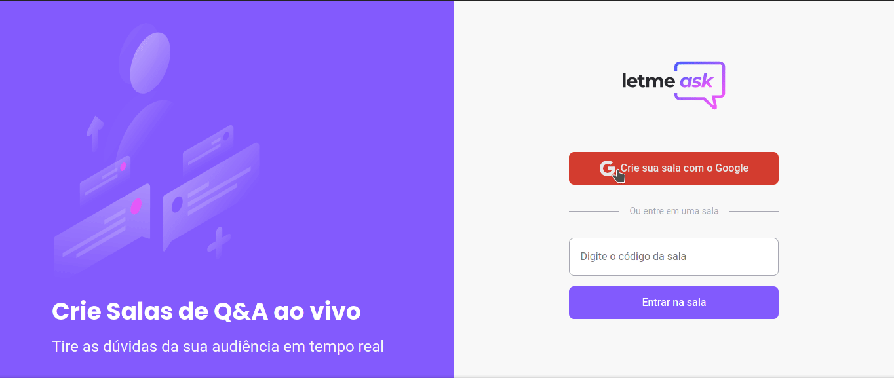

<p align="center">
  
</p>


<h1 align="center">
    
</h1>

<br>

## 🧪 New features

Some toast modals were implemented for better user experience

<h1 align="center">
    
</h1>


## 🧪 Technologies

This project was developed using the following technologies:

- [React](https://reactjs.org)
- [Firebase](https://firebase.google.com/)
- [TypeScript](https://www.typescriptlang.org/)

## 🚀 Getting started

Clone the project and access the folder.

The public URL can be found here: 

*Deployed version:* https://letmeaskreactnlw.web.app/


Local React.js development server:

```bash
$ git clone https://github.com/g-santosmartins/letmeask_react_nlw.git

```

```bash
$ cd letmeask
```

Follow the steps below:
```bash
# Install the dependencies
$ yarn

or 

$npm (v14.0.0 or older) 

Use NVM, if you will

# Start the project
$ yarn start

$npm install

```
The app will be available for access on your browser at http://localhost:3000

## 🔖 Layout

You can view the project layout through the links below:

- [Layout Web](https://www.figma.com/file/u0BQK8rCf2KgzcukdRRCWh/Letmeask/duplicate) 

Remembering that you need to have a [Figma](http://figma.com/) account to access it.

## 📝 License

This project is licensed under the MIT License. See the [LICENSE](LICENSE.md) file for details.


---

<p align="center">Made with ❤️ by Guilherme Martins</p>